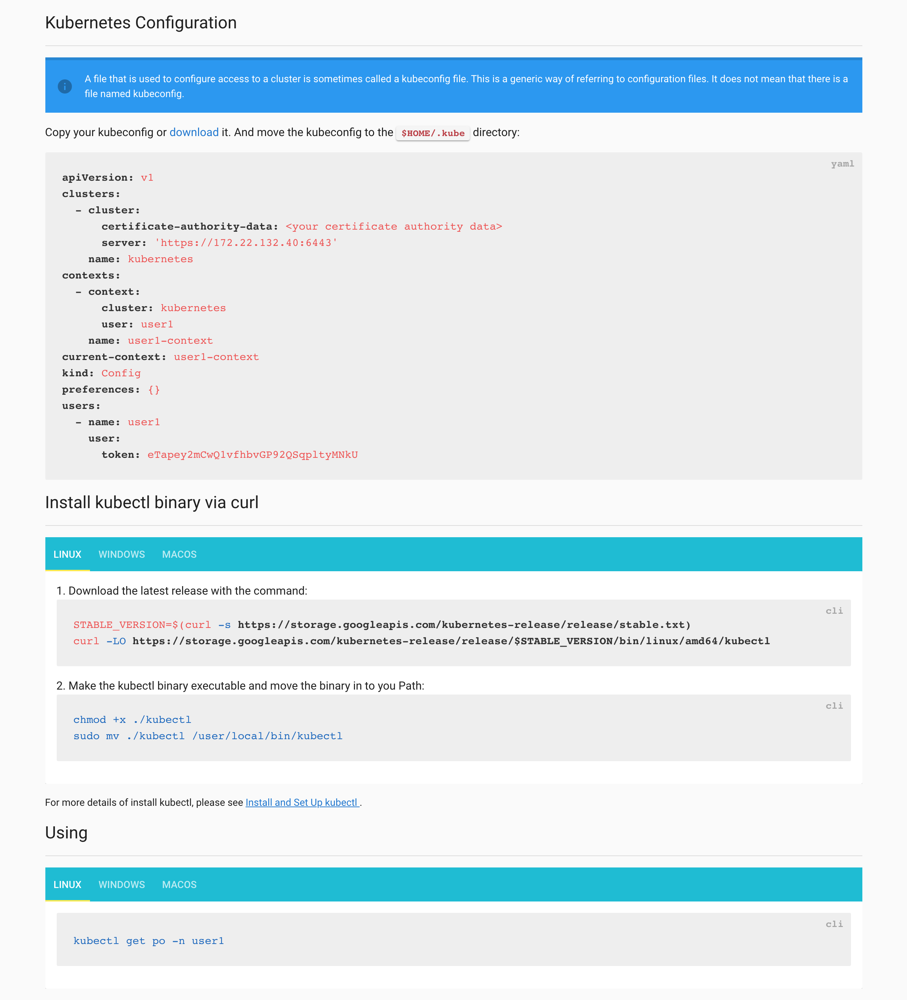

[](https://travis-ci.org/inwinstack/kubeconfig-generator) [](https://hub.docker.com/r/inwinstack/kg-server/)

# Kubeconfig Generator
Kubeconfig Generator is a tool to generate kubeconfig for LDAP, Keystone, ..., etc webhook.

Now support webhook as below:
* [x] LDAP Webhook.
* [ ] Keystone Webhook.

## Building from Source
Clone into your go path under `$GOPATH/src/github.com/inwinstack`:
```sh
$ git clone https://github.com/inwinstack/kubeconfig-generator.git $GOPATH/src/github.com/inwinstack/kubeconfig-generator.git
$ cd $GOPATH/src/github.com/inwinstack/kubeconfig-generator.git
$ make
```

## Quick Start
In this first, modified the `deploy/kg-deployment.yml` file to match our LDAP and Kubernetes API server endpoint:
```yml
# container args
spec:
  template:
    spec:
      containers:
      - name: kg-server
        image: inwinstack/kg-server:v0.1.0
        args:
        - serve
        - --kube-apiserver-endpoint=https://192.16.35.11:6443
        - --ldap-address=192.16.35.20:389
        - --ldap-dc=dc=k8s,dc=com
        - --user-search-base=ou=People,dc=k8s,dc=com
        - --user-name-attribute=givenName
        - --user-token-arttribute=kubernetesToken
```

And then apply to Kubernetes cluster:
```sh
$ kubectl apply -f deploy/
```

To generate the config using kgctl:
```sh
$ kgctl ldap --url http://172.22.132.40:32400 \
    --dn "uid=user1,ou=People,dc=k8s,dc=com" \
    --password "user1" \
    -o test.conf
# output
Generate the Kubernetes config to `test.conf`.

$ export KUBECONFIG=test.conf
$ kubectl -n user1 get po
```
> Or access `Web-based UI`.


